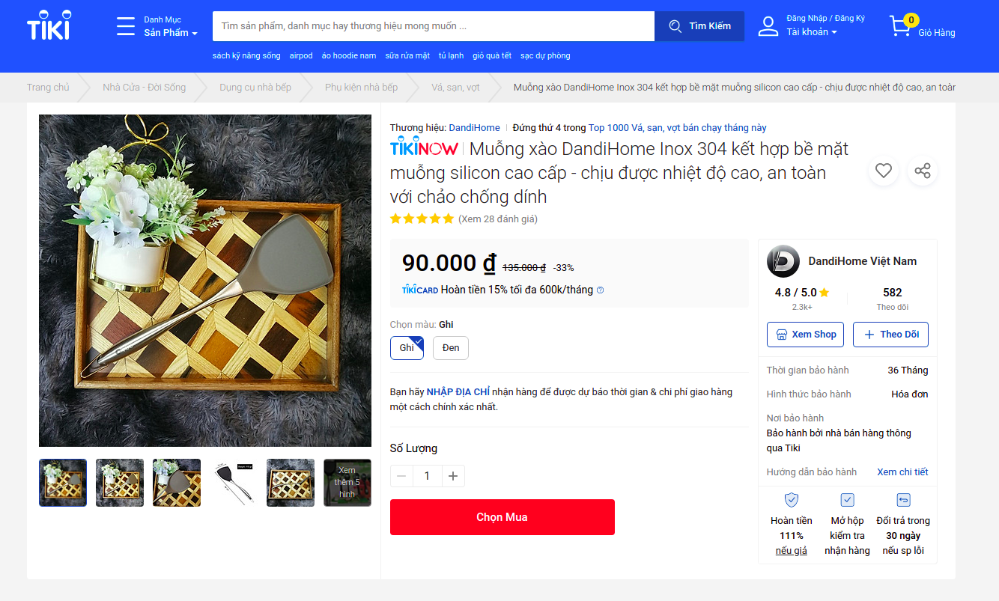

# Jsoup-parse-content-website
Parse website and content extraction with jsoup <br />
Project inspired by 2 articles [https://dl.acm.org/doi/10.1145/2009916.2009952](https://dl.acm.org/doi/10.1145/2009916.2009952) and [https://dl.acm.org/doi/10.1145/1718487.1718542](https://dl.acm.org/doi/10.1145/1718487.1718542)
<br /><br />
For example, we extraction content website https://tiki.vn/muong-xao-dandihome-inox-304-ket-hop-be-mat-muong-silicon-cao-cap-chiu-duoc-nhiet-do-cao-an-toan-voi-chao-chong-dinh-p68607055.html : 
<br /><br />
**and here is my result** : 
```
Giá sản phẩm trên Tiki đã bao gồm thuế theo luật hiện hành. Tuy nhiên tuỳ vào từng loại sản phẩm hoặc phương thức, địa chỉ giao hàng mà có thể phát sinh thêm chi phí khác như phí vận chuyển, phụ phí hàng cồng kềnh, ...
Muỗng xào đa năng DandiHome sử dụng chất liệu Inox 304 để làm cán và lõi bên trong.
Phần muỗng sử dụng chất liệu Silicon loại để sản xuất núm ti giả trẻ em: chịu nhiệt độ lên đến 200 độ, không thôi nhiễm vào thực phẩm khi đun nấu, không lo biến dạng, nứt bể.
An toàn với chảo chống dính, không là xước nồi.
Bên trong muỗng là lõi inox 304, giúp dễ dàng lật hay xào nấu thức ăn. Không bị mềm như 1 số mẫu trên thị trường.
Thiết kế móc treo tiện lợi, tiết kiệm diện tích căn bếp.
Kích thước: 34 x 10 cm
Khối lượng: 115gr

Muỗng xào DandiHome Inox 304 kết hợp bề mặt muỗng silicon cao cấp - chịu được nhiệt độ cao, an toàn với chảo chống dính
Muỗng xào DandiHome Inox 304 kết hợp bề mặt muỗng silicon cao cấp - chịu được nhiệt độ cao, an toàn với chảo chống dính
Thông tin chi tiết
MÔ TẢ SẢN PHẨM
```
